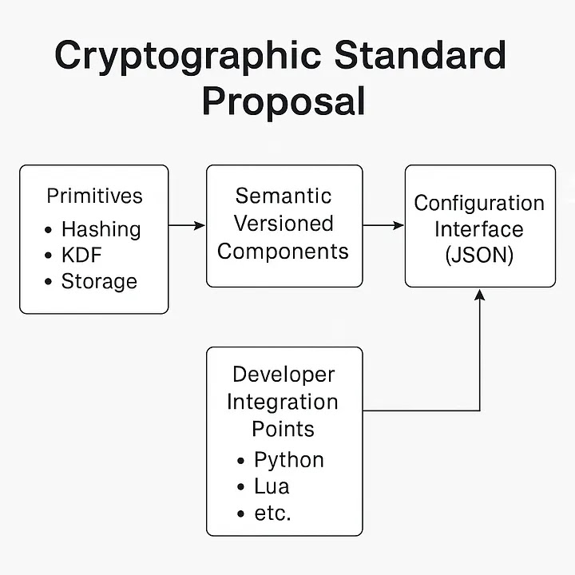
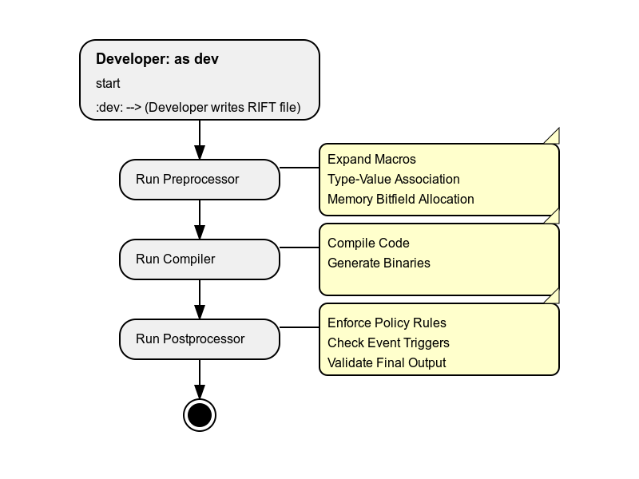
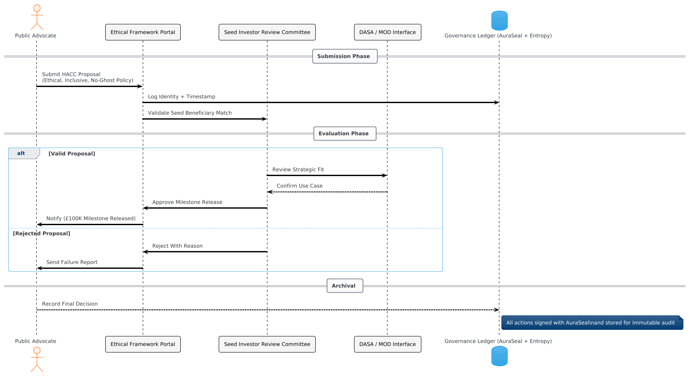
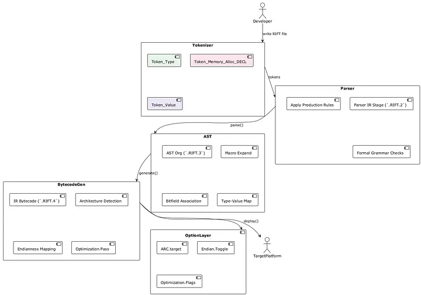

# RIFT - Flexible Translator (aka RIFT is a Flexible Translator)
 

**OBINexus Computing Division** | **Computing From the Heart**
  
> **The Founder of OBINexus** — Forever in our hearts  
> **Technical Lead:** Nnamdi Michael Okpala 

[](#build--toolchain)
[](#security-architecture)
[](#cost-governance-with-sinphasé)
[](#validation--testing)
[](#contribution--compliance)

**Primary Technical Lead:** Nnamdi Michael Okpala  
**Technical Leadership Verification:**
- [NCFE Level 3 Certificate in Coding Practices (Qualification #603/5793/9)](docs/img/bachelor_front.jpg)
- [Gateway Qualifications Level 2 Diploma in IT User Skills (ITQ) - South Essex College](docs/img/bachelor_back.jpg)

**Project Repositories:**
- **Core Framework:** [github.com/obinexus/rift](https://github.com/obinexus/rift)
- **Web Integration:** [github.com/obinexus/rift-bridge](https://github.com/obinexus/rift-bridge)

> **RIFT is a Flexible Translator** - A direct competitor to YACC (Yet Another Compiler Compiler), RIFT is a secure, multi-stage, self-auditing compiler system implementing systematic language engineering through formal automaton theory and Zero Trust governance principles.

> ⚠️ **Naming Convention Lock**: The definition of RIFT as a "Flexible Translator" and competitor to YACC is established project specification. Any attempt to redefine RIFT from its established technical identity is prohibited within this project scope.

## 🏗️ Project Overview

### What is RIFT?

**RIFT** (Flexible Translator) implements a systematic approach to programming language compilation through hierarchical component isolation and cost-based governance. As a direct competitor to YACC (Yet Another Compiler Compiler), RIFT transforms high-level `.rift` logic declarations into secure, executable artifacts across multiple target languages while maintaining deterministic build behavior and comprehensive audit trails.

RIFT forms a core component of the **OBINexus language architecture and language engine initiative**, developed as live work by Nnamdi Michael Okpala. The framework provides enterprise-grade compilation capabilities with integrated governance, cost monitoring, and zero-trust security principles.

## 📑 Peer Review Proofs

All formal peer review proof artifacts, technical validation documents, and compliance evidence for RIFT are maintained in the [`pr-proof/`](docs/pr-proof/) directory.  
For a detailed overview of the proof process, governance integration, and artifact usage, see the [Peer Review Proofs README](docs/pr-proof/README.md).

These documents include:

- Formal mathematical reasoning and automaton proofs
- Cryptographic standards and protocol validation
- Governance compliance evidence and audit trails

All proofs are systematically reviewed and validated as part of the CI/CD process to ensure full alignment with RIFT’s governance and technical standards.

## 📊 Architecture Overview

The RIFT framework implements systematic design principles across multiple architectural layers, providing comprehensive documentation for developers and auditors. Each architectural component represents a critical aspect of RIFT's technical distinction as a next-generation flexible translator framework.


## 📚 Visual Architecture Gallery

### 1. Cryptographic Integration Model



This diagram illustrates the OBINexus Cryptographic Standard v1.0, detailing allowed algorithms (e.g., SSH_SHANNON_SHA3, PBKDF2_HMAC_SHA512, AES-256-GCM), security timeouts, cryptographic primitives (hashing, KDF, storage/memory encryption), and the verification process that secures and validates protocol state transitions within RIFT.

---

### 2. Compiler Lifecycle Flow



This flowchart visualizes the RIFT compiler's structured phases: preprocessor (macro expansion, type-value association, memory allocation), compiler (code compilation, binary generation), and postprocessor (policy enforcement, event validation, output verification). Each stage enforces modularity and auditability.

---

### 3. Governance Validation Lifecycle



This sequence diagram shows the governance process: public advocate proposal submission, ethical and strategic evaluation, milestone approval or rejection, and immutable audit logging via AuraSeal. It ensures transparent, ethical, and auditable project management.

---

### 4. Language Processing Pipeline




This diagram details the RIFT language processing pipeline: tokenization, parsing, AST generation, macro expansion, bytecode generation, and deployment to target platforms. It highlights how `.rift.N` files map to traditional compiler theory and RIFT’s extensibility beyond YACC.

---

### 5. OBINexus Identity & Technical Origin


This symbol represents the OBINexus Computing Division’s motto: **Computing From the Heart**. It reinforces RIFT’s commitment to accessible compiler design, ethical implementation, and transparent tooling infrastructure—where trust, clarity, and inclusion are foundational principles.

---

Each visual model serves as both architectural documentation and an educational scaffold for developers and auditors, capturing the essence of RIFT’s technical distinction as a next-generation flexible translator framework.

### 1.1 Cryptographic Integration Model

The standardized cryptographic primitives form the security foundation of RIFT's compilation infrastructure. This architecture encompasses:

- **Cryptographic Primitives**: Hashing algorithms, Key Derivation Functions (KDF), and secure storage mechanisms
- **Semantic Versioning**: Modular component management with version-controlled cryptographic interfaces  
- **JSON Configuration Interface**: Standardized configuration management supporting multiple developer integration points
- **Developer Integration Points**: Support for Python, Lua, and extensible language bindings

This cryptographic stack ensures trust verification in RIFT's compiler outputs while enabling secure integration with external tools including RIFT-Bridge web components.

### 1.2 Compiler Lifecycle Flow

The structured compilation phases implement systematic processing through three primary stages:

- **Preprocessor Phase**: Macro expansion, type-value association, and memory allocation management
- **Compiler Phase**: Code compilation, binary generation, and optimization processing
- **Postprocessor Phase**: Policy enforcement, event trigger validation, and final output verification

This modular architecture ensures high-level component isolation while maintaining enforceable build policies and comprehensive audit trail generation throughout the compilation process.

### 1.3 Governance Validation Lifecycle

The proposal and milestone management system implements transparent project governance through systematic validation:

- **Submission Phase**: Public advocate proposal submission through ethical framework portal
- **Evaluation Phase**: Seed investor review committee and DASA/MOD interface validation
- **Approval Process**: Strategic fit review, use case confirmation, and milestone release authorization
- **Audit Trail**: AuraSeal cryptographic validation ensuring immutable decision tracking

This governance framework reinforces project auditability and compliance integrity through milestone-based funding releases and comprehensive stakeholder validation protocols.

### 1.4 Language Processing Pipeline

The core RIFT compiler system implements systematic language processing through integrated pipeline stages:

- **Tokenization**: Token_Type and Token_Memory_Alloc processing with governance binding
- **Parser Integration**: Production rules application and formal grammar validation
- **AST Generation**: Abstract syntax tree construction with macro expansion support
- **Bytecode Generation**: IR bytecode creation with architecture detection and optimization layers
- **Target Platform**: Deployment options with endian control and platform-specific optimizations

This processing pipeline demonstrates how `.rift.N` files integrate with traditional compiler theory while providing extensible alternatives to YACC through systematic real-world implementation.

### 7-Stage Compilation Pipeline

RIFT employs the **AEGIS** (Automaton Engine for Generative Interpretation & Syntax) framework through a systematic 7-stage pipeline:

| Stage | Component | Primary Function | Output Artifact | Governance File |
|-------|-----------|------------------|-----------------|-----------------|
| **0** | **Tokenizer** | Lexical analysis + NULL→nil transformation | Token stream | `.riftrc.0` |
| **1** | **Parser** | Grammar structuring + Yoda-style validation | Parse tree | `.riftrc.1` |
| **2** | **AST Generator** | Abstract syntax tree construction | AST nodes | `.riftrc.2` |
| **3** | **Validator** | Schema compliance + constraint verification | Validated AST | `.riftrc.3` |
| **4** | **Bytecode** | Intermediate representation generation | IR bytecode | `.riftrc.4` |
| **5** | **Verifier** | Integrity validation + exception stratification | Verified IR | `.riftrc.5` |
| **6** | **Emitter** | Target language generation | `.mylang`, `.py`, `.mpl` | `.riftrc.6` |

### .rift File Protocol

`.rift` files serve as high-level logic declarations that define both program semantics and compilation governance:

```json
{
  "stage": 0,
  "token_type": "symbol",
  "token_memory": "volatile",
  "thread_lifecycle": "010111",
  "governance": {
    "yoda_style": true,
    "null_semantics": "nil_transform",
    "cost_threshold": 0.4
  },
  "audit": {
    "telemetry_level": "enhanced",
    "exception_classification": "moderate"
  }
}
```

**Supported Output Formats:**
- `.mylang` - Custom language specifications with governance annotations
- `.mpl` - Mathematical Programming Language with formal verification
- `.py` - Python with safety extensions and audit bindings
- `.c` - C with memory safety enhancements
- `.js` - JavaScript with integrity validation
- `.wasm` - WebAssembly with cryptographic verification

## 🔐 Security Architecture

### NULL/nil Semantic Transformation

RIFT implements systematic memory safety through semantic transformation:

- **NULL (C-style)**: Legacy pointer representation, automatically detected during tokenization
- **nil (RIFT-specific)**: Memory-safe null representation with comprehensive audit tracking
- **Transformation Protocol**: All NULL references undergo automatic conversion to `nil` with governance validation

```c
// Stage 0 Tokenizer: NULL→nil transformation with audit logging
if (token->value == NULL) {
    token->value = create_nil_token();
    log_transformation(AUDIT_0, "NULL→nil", token->position);
    increment_governance_penalty(0.1);
}
```

### Yoda-Style Branch Safety

RIFT enforces assignment-safe conditional structures to prevent common programming errors:

```c
// ✅ RIFT-Compliant: Assignment-safe conditional
if (42 == user_input) {
    process_valid_input();
}

// ❌ Governance Violation: Assignment-prone pattern
if (user_input = 42) {  // Triggers compile-time rejection
    // This pattern is blocked by .riftrc.N validation
}
```

**Enforcement Mechanism:**
- Compile-time validation through `.riftrc.N` governance contracts
- Static analysis integration with comprehensive pattern detection
- Audit trail generation for all conditional structure validation

### Thread Lifecycle Modeling

RIFT implements sophisticated concurrency control through parity elimination and lifecycle encoding:

```c
// Thread lifecycle representation: 6-bit context switch states
typedef struct {
    uint8_t lifecycle_state;    // "010111" encoded as binary
    uint32_t worker_count;      // Default: 32 workers per thread
    context_t* shared_stack;    // Fallback execution context
} rift_thread_t;

// Parity elimination for parallel execution
if (complexity_metric <= threshold) {
    schedule_thread(THREAD_LOW_COMPLEXITY, task);
} else if (complexity_metric >= threshold) {
    schedule_thread(THREAD_HIGH_COMPLEXITY, task);
} else {
    execute_shared_stack(task);  // Serial fallback
}
```

### Git-RAF Secure Staging

RIFT employs **Git-RAF** (Git Reflexive Audit Framework) for cryptographic commit validation:

**Required Commit Components:**
- **`aura_seal`**: SHA-256 cryptographic integrity verification
- **`entropy_checksum`**: PRNG-derived validation hash with temporal binding
- **`policy_tag`**: Governance compliance certification with stage validation

```bash
# Git-RAF compliant commit example
git commit -m "feat: Stage 2 AST optimization with cost reduction" \
  --aura-seal="SHA256:7f4a9b2c8e1d..." \
  --entropy-checksum="PRNG:3e8f1a9b4c7d..." \
  --policy-tag="SINPHASE:COMPLIANT:cost_0.34"
```

## ⚙️ Build & Toolchain

### Core Directory Architecture

```
rift/
├── rift-core/              # Foundation infrastructure & shared components
│   ├── include/            # Shared headers and common definitions
│   ├── src/                # Core implementation (thread safety, audit)
│   ├── build/              # Build artifacts (debug/prod/bin/obj/lib)
│   ├── setup/              # Infrastructure initialization scripts
│   └── CMakeLists.txt      # Root build configuration
├── rift-0/ ... rift-6/     # Stage-specific compiler implementations
│   ├── src/core/           # Stage-specific core logic
│   ├── src/cli/            # Command-line interface components
│   ├── include/riftN/      # Public API headers for stage N
│   ├── tests/qa_mocks/     # QA testing framework with edge cases
│   └── scripts/validation/ # Architecture compliance validation
├── rift-audit/             # Comprehensive audit trail system
│   ├── .audit-0            # stdin processing & tokenization events
│   ├── .audit-1            # stderr classification & exception handling
│   ├── .audit-2            # stdout verification with crypto hashing
│   └── telemetry-stream/   # Real-time governance monitoring
├── rift-bridge/            # Web integration & REPL portal
│   ├── wasm/               # WebAssembly compilation targets
│   ├── repl/               # Interactive development environment
│   └── bindings/           # Language-specific integration APIs
├── rift-gov/               # Governance contracts & policy enforcement
│   ├── .riftrc.0 ... .riftrc.6  # Stage-specific governance files
│   ├── cost_thresholds.json     # Sinphasé cost configuration
│   └── policy_validation.sh     # Automated compliance verification
└── rift-telemetry/         # Cryptographic tracking & monitoring
    ├── prng_generators/    # Secure random number generation
    ├── uuid_tracking/      # Unique identifier management
    └── entropy_analysis/   # Statistical validation frameworks
```

### Setup & Installation

```bash
# 1. Initialize RIFT-Core infrastructure
chmod +x rift-core/setup/setup-rift-core.sh
./rift-core/setup/setup-rift-core.sh --verbose --enable-telemetry

# 2. Configure build environment
mkdir -p build && cd build
cmake .. -DCMAKE_BUILD_TYPE=Release \
         -DENABLE_RIFT_AUDIT=ON \
         -DENABLE_COST_MONITORING=ON

# 3. Build complete pipeline
make -j$(nproc) all

# 4. Validate installation integrity
make test
./tools/qa_framework.sh --comprehensive
./scripts/validation/validate_obinexus.sh
```

### CLI Usage Examples

```bash
# Single-stage processing
./bin/rift0.exe input.rift --output=tokens.ir --verbose
./bin/rift1.exe tokens.ir --mode=recursive-descent --output=ast.tree

# Multi-stage pipeline execution
./bin/rift compile input.rift \
  --stages=0-6 \
  --target=mylang \
  --output=program.mylang \
  --audit-level=enhanced

# Interactive REPL with governance monitoring
./bin/rift repl \
  --enable-telemetry \
  --cost-monitoring \
  --stage=all

# Comprehensive audit analysis
./bin/rift audit \
  --trace-file=execution.trace \
  --stages=0-6 \
  --export-governance-report
```

### Audit File Protocols

| File | Purpose | Content Format | Validation |
|------|---------|----------------|------------|
| `.audit-0` | Standard input processing | Tokenization events + NULL→nil transformations | Schema + entropy |
| `.audit-1` | Standard error handling | Exception classification + stack traces | Error code validation |
| `.audit-2` | Standard output verification | Generated artifacts + cryptographic hashes | Integrity verification |

## 📊 Cost Governance with Sinphasé

### Cost Calculation Formula

RIFT implements systematic architectural cost monitoring through the Sinphasé methodology:

```c
RIFTCost = Σ(stage_metric[i] × governance_weight[i]) + audit_penalty + thread_complexity

where:
- stage_metric[i] ∈ {token_density, parse_complexity, ast_depth, validation_cycles, ir_size, verification_time, emission_overhead}
- governance_weight[i] = predefined architectural impact coefficients
- audit_penalty = 0.1 per governance violation + 0.2 per circular dependency
- thread_complexity = concurrency_overhead + synchronization_cost
```

### Sinphasé Cost Tiers

| Tier | Cost Range | Classification | Isolation Protocol |
|------|------------|----------------|--------------------|
| **Core-Stable** | ≤ 0.4 | Foundation components (Stages 0-1) | Maintain in `core-stable/` |
| **Processing-Dynamic** | 0.4 < Cost ≤ 0.6 | Active development (Stages 2-4) | Monitor in `processing-dynamic/` |
| **Output-Isolated** | 0.6 < Cost ≤ 0.8 | High-complexity operations (Stages 5-6) | Isolate in `output-isolated/` |
| **Governance-Critical** | > 0.8 | Requires architectural reorganization | Trigger isolation protocol |

### Isolation Trigger Mechanisms

```bash
# Cost threshold exceeded - automatic isolation
if (calculated_cost > threshold) {
    create_isolation_directory("root-dynamic-c/component-v2/");
    generate_independent_makefile();
    resolve_circular_dependencies();
    log_architectural_decision("ISOLATION_LOG.md");
    validate_single_pass_compilation();
}
```

### Governance File Structure

Each stage maintains governance contracts through `.riftrc.N` files:

```json
{
  "stage_id": 2,
  "cost_threshold": 0.6,
  "isolation_enabled": true,
  "governance_rules": {
    "max_ast_depth": 32,
    "circular_dependency_tolerance": 0,
    "memory_allocation_limit": "64MB"
  },
  "audit_requirements": {
    "telemetry_level": "enhanced",
    "exception_stratification": true,
    "cost_monitoring": "real_time"
  }
}
```

## 📁 Directory Structure

```
rift/
├── 📦 rift-core/                    # Foundation Infrastructure
│   ├── 📁 include/                  # Shared headers & definitions
│   │   ├── rift/
│   │   │   ├── core/               # Core API definitions
│   │   │   ├── governance/         # Policy enforcement interfaces
│   │   │   └── audit/              # Audit system interfaces
│   │   └── thread/                 # Thread safety primitives
│   ├── 📁 src/                     # Core implementations
│   │   ├── audit/                  # Audit trail management
│   │   ├── governance/             # Policy enforcement logic
│   │   ├── telemetry/              # Monitoring & tracking
│   │   └── thread/                 # Concurrency management
│   ├── 📁 build/                   # Build artifacts
│   │   ├── debug/                  # Development builds
│   │   ├── prod/                   # Production releases
│   │   ├── bin/                    # Executable artifacts
│   │   ├── lib/                    # Static/dynamic libraries
│   │   └── obj/                    # Intermediate objects
│   └── 📁 setup/                   # Infrastructure scripts
│       ├── setup-rift-core.sh     # Primary setup automation
│       └── telemetry/              # Monitoring configuration
├── 🔄 rift-0/ ... rift-6/          # Stage-Specific Implementations
│   ├── 📁 src/
│   │   ├── core/                   # Stage-specific logic
│   │   └── cli/                    # Command-line interfaces
│   ├── 📁 include/rift-N/          # Public stage APIs
│   ├── 📁 tests/
│   │   ├── qa_mocks/               # QA testing framework
│   │   └── edge_case_registry/     # Comprehensive edge cases
│   ├── 📁 scripts/
│   │   ├── validation/             # Architecture compliance
│   │   └── deployment/             # Stage deployment
│   └── 📁 examples/                # Sample .rift programs
├── 🌐 rift-bridge/                 # Web Integration Portal
│   ├── 📁 wasm/                    # WebAssembly targets
│   ├── 📁 repl/                    # Interactive environments
│   └── 📁 bindings/                # Language integrations
├── 📋 rift-audit/                  # Audit Trail System
│   ├── .audit-0                   # Input processing logs
│   ├── .audit-1                   # Error classification logs
│   ├── .audit-2                   # Output verification logs
│   └── 📁 telemetry-stream/        # Real-time monitoring
├── ⚖️ rift-gov/                    # Governance & Policy
│   ├── .riftrc.0 ... .riftrc.6    # Stage governance contracts
│   ├── cost_thresholds.json       # Sinphasé configuration
│   └── policy_validation.sh       # Compliance automation
├── 📊 rift-telemetry/              # Cryptographic Tracking
│   ├── 📁 prng_generators/         # Secure randomization
│   ├── 📁 uuid_tracking/           # Identifier management
│   └── 📁 entropy_analysis/        # Statistical validation
└── 🔧 tools/                       # Development Utilities
    ├── 📁 qa/                      # Quality assurance
    ├── 📁 validation/              # Compliance checking
    └── 📁 deployment/              # Release management
```

## 🧪 Validation & Testing

### QA Protocol Framework

RIFT implements comprehensive quality assurance through systematic validation protocols:

**1. Edge Case Registry**
- **Global Documentation**: `QA/edge_case_registry.md`
- **Framework Implementation**: `tests/qa_mocks/edge_case_qa_framework/`
- **Automated Detection**: Pattern matching for known edge conditions

**2. Entropy Analysis**
- **PRNG Validation**: Cryptographic randomness verification
- **Statistical Testing**: Chi-square, frequency, and distribution analysis
- **Temporal Correlation**: Time-based entropy pattern detection

**3. Build Signature Verification**
- **Artifact Integrity**: SHA-256 checksums for all build outputs
- **Dependency Validation**: Transitive dependency graph verification
- **Reproducible Builds**: Deterministic output validation across environments

### Validation Requirements Matrix

| Component | Requirement | Validation Method | Acceptance Criteria |
|-----------|-------------|-------------------|---------------------|
| **Build System** | `make test` pass | Automated test suite | 100% test passage |
| **Compilation** | `make build` success | Multi-stage compilation | Zero compilation errors |
| **Governance** | Zero Trust validation | Cryptographic verification | Policy compliance verified |
| **Cost Monitoring** | Sinphasé thresholds | Real-time cost tracking | All stages within thresholds |
| **Audit Trails** | Complete logging | Comprehensive audit analysis | Full traceability maintained |

### Fail-Fast Enforcement

```c
// Example: Stage transition validation with fail-fast enforcement
typedef enum {
    STAGE_TRANSITION_SUCCESS,
    STAGE_TRANSITION_COST_EXCEEDED,
    STAGE_TRANSITION_GOVERNANCE_VIOLATION,
    STAGE_TRANSITION_AUDIT_FAILURE
} stage_transition_result_t;

stage_transition_result_t validate_stage_transition(int from_stage, int to_stage) {
    if (calculate_cost(to_stage) > get_threshold(to_stage)) {
        trigger_isolation_protocol();
        return STAGE_TRANSITION_COST_EXCEEDED;
    }
    
    if (!validate_governance_compliance(to_stage)) {
        log_governance_violation(from_stage, to_stage);
        return STAGE_TRANSITION_GOVERNANCE_VIOLATION;
    }
    
    return STAGE_TRANSITION_SUCCESS;
}
```

### Architecture Compliance Scripts

```bash
# Comprehensive architecture validation
./scripts/validation/validate-architecture.sh
./scripts/validation/validate_obinexus.sh
./scripts/validation/integrated_aegis_validation.sh

# Cost threshold monitoring
./tools/qa_framework.sh --cost-analysis
./tools/dependency_validation.sh --circular-check

# Governance compliance verification
./rift-gov/policy_validation.sh --stage=all
./tools/aegis_recovery.sh --validate-governance
```

## ✍️ Contribution & Compliance

### Development Standards

**Technical Requirements:**
- **Language Compliance**: C11 standard with AEGIS security flags (`-Werror`, `-Wall`, `-Wextra`)
- **Memory Safety**: Comprehensive error handling with systematic cleanup protocols
- **Documentation**: Doxygen comments for all public interfaces with architectural context
- **Testing**: TDD methodology with unit, integration, and benchmark coverage

**Code Quality Metrics:**
- **Coverage Target**: Minimum 85% code coverage across all stages
- **Complexity Limits**: Cyclomatic complexity ≤ 15 per function
- **Performance**: Zero performance regression in critical paths
- **Security**: Static analysis with comprehensive vulnerability scanning

### Contribution Workflow

**Phase-Gated Development Process:**

1. **Requirements Phase**
   - [ ] Technical specification documentation with architectural impact analysis
   - [ ] Cost prediction modeling for affected stages
   - [ ] Governance compliance pre-validation
   - [ ] Integration requirements with existing pipeline stages

2. **Design Phase**
   - [ ] Architectural review with Sinphasé cost implications
   - [ ] Interface design with comprehensive error handling
   - [ ] Performance impact analysis with benchmarking
   - [ ] Security review with threat modeling

3. **Implementation Phase**
   - [ ] Test-driven development with comprehensive edge case coverage
   - [ ] Real-time cost monitoring during development
   - [ ] Continuous integration with automated validation
   - [ ] Peer review with architectural compliance verification

4. **Validation Phase**
   - [ ] Complete test suite execution with QA framework validation
   - [ ] Architecture compliance verification through automated scripts
   - [ ] Performance benchmarking with regression analysis
   - [ ] Security validation with comprehensive penetration testing

5. **Documentation Phase**
   - [ ] Technical specification updates with implementation details
   - [ ] User guide enhancements with practical examples
   - [ ] Compliance documentation with audit trail generation
   - [ ] Deployment guide updates with operational procedures

### Git-RAF Compliance Requirements

**Mandatory Commit Components:**
```bash
# All commits must include comprehensive audit metadata
git commit -m "feat: Stage N implementation with governance compliance" \
  --aura-seal="SHA256:$(generate_aura_seal)" \
  --entropy-checksum="PRNG:$(generate_entropy)" \
  --policy-tag="SINPHASE:COMPLIANT:cost_$(calculate_cost)" \
  --governance-validated="$(validate_policy_compliance)"
```

**Pull Request Checklist:**
- [ ] Git-RAF commit validation (aura_seal + entropy_checksum + policy_tag)
- [ ] Comprehensive cost impact analysis for all affected stages
- [ ] Test coverage maintenance with edge case validation
- [ ] Technical documentation updates with architectural context
- [ ] Governance compliance certification with automated validation
- [ ] Sinphasé phase gate approval with stakeholder authorization

### NASA-STD-8739.8 Alignment

RIFT development maintains alignment with NASA-STD-8739.8 software safety assurance:

- **Deterministic Execution**: All operations produce identical results with identical inputs
- **Bounded Resource Usage**: Memory and computational requirements with provable upper bounds
- **Formal Verification**: Mathematical proof of safety properties for critical components
- **Graceful Degradation**: Predictable and recoverable failure modes with comprehensive logging

### OBINexus Technical Standards

**Collaborative Development:**
- **Lead Architect**: Nnamdi Michael Okpala - systematic problem identification and resolution
- **Methodology**: AEGIS Waterfall with comprehensive phase gate validation
- **Communication**: Professional software engineering with methodical documentation
- **Quality Assurance**: Systematic testing with automated compliance verification

**Technical Excellence Metrics:**
- **Architecture Integrity**: Sinphasé cost governance with real-time monitoring
- **Security Posture**: Zero Trust principles with comprehensive audit trails
- **Performance Optimization**: Systematic bottleneck identification and resolution
- **Collaborative Innovation**: Structured team integration with clear technical leadership

## 📄 License & Support

### Licensing Framework

**OBINexus Computing Framework License** with enhanced security requirements:

- **Governance Compliance**: All derivatives must maintain Git-RAF audit validation
- **Cost Threshold Preservation**: Modifications cannot exceed Sinphasé boundaries without isolation
- **Zero Trust Requirements**: Security properties must be formally verified for production deployment
- **Technical Attribution**: Collaborative development with Nnamdi Michael Okpala acknowledgment

### Professional Support

**Technical Resources:**
- **Repository**: [github.com/obinexus/rift](https://github.com/obinexus/rift)
- **Documentation**: Comprehensive technical specifications in `/docs/`
- **Issue Tracking**: GitHub Issues with systematic problem reporting templates
- **QA Framework**: Automated validation through `./tools/qa_framework.sh`

**Development Coordination:**
- **Technical Leadership**: Systematic problem identification with collaborative resolution
- **Methodology**: AEGIS Waterfall with structured phase gate progression
- **Quality Standards**: Professional software engineering with comprehensive validation
- **Collaboration Model**: Technical team integration with methodical development approaches

### Related Ecosystem Projects

- **[rift-bridge](https://github.com/obinexus/rift-bridge)**: Web-based RIFT compiler integration
- **[git-raf](https://github.com/obinexus/git-raf)**: Secure audit framework for version control
- **OBINexus AEGIS**: Comprehensive computing framework with Zero Trust architecture

---

**RIFT Development Philosophy**: *"Structure IS the syntax. In RIFT, systematic methodology enables technical excellence."*
